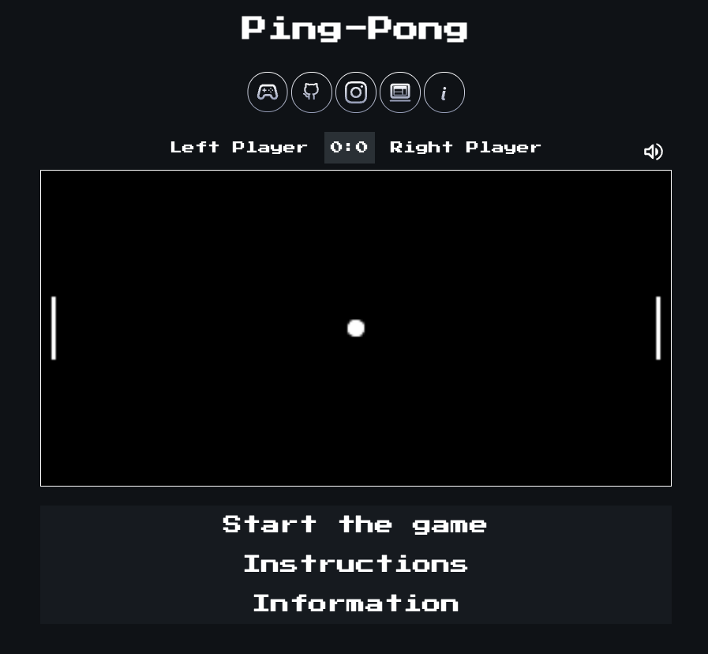

  

# 🎮 Games — Web Mini Projects  

A collection of small browser-based games built to practice HTML, CSS, and JavaScript while exploring game logic and frontend design.

## Logic Scripts
The logic for each game is placed inside src/games/.

---

🕹️ **Games Included:**
- [Ping-Pong](https://kelwynoliveira.github.io/games/games-page/pingpong.html) 🏓
- [Crossy Road](https://kelwynoliveira.github.io/games/games-page/croassy-road.html) 🐸

---

💡 **Purpose**  
This project was created to:
- Strengthen my understanding of JavaScript DOM manipulation.
- Practice responsive design for both desktop and mobile.
- Explore game logic implementation using web technologies.

---

🚀 **Play the Games**  
[👉 Click here to play](https://kelwynoliveira.github.io/games/)

---

🧠 **Note:**  
This project represents an early stage of my frontend development learning path. It combines logic, creativity, and problem-solving through playful experimentation.

---

📸 **Preview:**  

